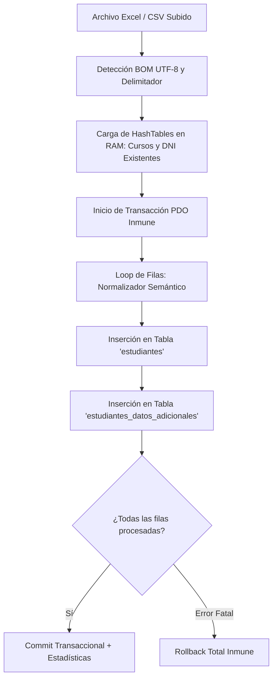

# 🚀 PROPUESTA TÉCNICA: MOTOR INTELIGENTE DE MIGRACIÓN Y CARGA MASIVA DE ESTUDIANTES

**Autor:** Asistente Élite  
**Destinatario:** Ingeniero Ricardo  
**Fecha:** 25 de Agosto de 2026  
**Estado:** Propuesta Técnica y Arquitectura de Ingestión

---

## 📌 1. Justificación y Contexto Operativo
En el ecosistema escolar colombiano, el proceso de matrícula masiva (al inicio de cada año lectivo o en migraciones desde plataformas como el **SIMAT**) representa el cuello de botella más crítico. 

Matricular manualmente a 800 o 2.000 estudiantes mediante formularios individuales no solo satura el departamento de secretaría académica, sino que introduce errores de digitación. La solución estándar en la industria es la carga masiva mediante archivos **Excel / CSV**.

Sin embargo, los archivos generados por usuarios humanos o exportados de otros sistemas presentan **altas discrepancias semánticas y de formato**. La presente arquitectura dota al backend de una **capa de sanitización y normalización inteligente** capaz de absorber estas discrepancias sin rechazar el archivo ni requerir que el usuario lo limpie manualmente.

---

## 🧠 2. Capa de Normalización Inteligente (Reglas de Transformación)

### A. Tipo de Documento de Identidad
El motor analiza semánticamente el texto ingresado y lo homologa al estándar oficial:
| Entrada del Usuario / Excel | Normalización a Base de Datos |
| :--- | :--- |
| `TI`, `T.I.`, `T.I`, `Tarjeta`, `Tarjeta de Identidad`, `Tarjeta Identidad` | **`TI`** |
| `CC`, `C.C.`, `C.C`, `Cedula`, `Cédula`, `Cédula de Ciudadanía`, `DNI` | **`CC`** |
| `RC`, `R.C.`, `R.C`, `Registro`, `Registro Civil` | **`RC`** |
| `CE`, `C.E.`, `Cédula de Extranjería`, `Extranjeria` | **`CE`** |
| `PPT`, `Permiso por Proteccion Temporal`, `P.P.T.` | **`PPT`** |
| `PEP`, `Permiso Especial de Permanencia`, `P.E.P.` | **`PEP`** |
| `NES`, `Numero Establecido por Secretaria` | **`NES`** |

### B. Número de Identificación
- **Limpieza de caracteres no numéricos:** Elimina puntos, guiones, comas y espacios (`"1.042.253.479"` $\rightarrow$ `"1042253479"`).
- **Protección contra duplicados:** Validación previa en memoria (HashTable) contra la base de datos para omitir o alertar registros ya existentes sin romper la transacción.

### C. Fechas de Nacimiento (Parser Multiformato)
El motor detecta dinámicamente y procesa múltiples estructuras:
1. `YYYY-MM-DD` (ISO estándar, ej: `2012-05-24`)
2. `DD/MM/YYYY` (Formato tradicional colombiano, ej: `24/05/2012`)
3. `DD-MM-YYYY` (Separador con guiones, ej: `24-05-2012`)
4. **Serial numérico de Excel** (ej: `41053` $\rightarrow$ convertido automáticamente a `2012-05-24`).
5. **Cálculo automático de la edad:** Deriva y almacena automáticamente el campo `edad` en `estudiantes_datos_adicionales`.

### D. Lugar de Nacimiento (Valor Geográfico Inteligente)
- Si el campo viene vacío o únicamente contiene el nombre de la ciudad (`"Barranquilla"`):
  - El motor autocompleta con la jerarquía institucional: **`Colombia / Atlántico / Barranquilla`**.
- Si contiene país o departamento explícito, preserva la estructura normalizada.

### E. Género y Grupo Sanguíneo (RH)
- **Género:**
  - `"Masculino"`, `"Hombre"`, `"M"`, `"H"`, `"Masc"` $\rightarrow$ **`M`**
  - `"Femenino"`, `"Mujer"`, `"F"`, `"Fem"` $\rightarrow$ **`F`**
- **RH:**
  - Limpieza de espacios y normalización: `"o+"`, `"O +"`, `"O Positivo"` $\rightarrow$ **`O+`**; `"A-"`, `"A Negativo"` $\rightarrow$ **`A-`**.

### F. Mapeo Automático de Cursos
- Compara el texto de la columna `curso` contra la tabla `cursos` ignorando mayúsculas, tildes y espacios extras (`"primero a"`, `"PRIMERO A"`, `"1A"` $\rightarrow$ resuelve automáticamente el `curso_id` correspondiente).

---

## 🛡️ 3. Tratamiento de Fotografías Digitales
1. **En la Carga Masiva:** La columna de fotografía se omite deliberadamente del archivo CSV/Excel.
2. **Post-Carga:** El estudiante se crea con el avatar vectorial del sistema y la foto puede cargarse:
   - Individualmente desde el modal de edición de expediente (`editarEstudiante`).
   - Vía captura directa con cámara web o escaneo de carnés.

---

## ⚡ 4. Arquitectura de Ejecución y Rendimiento

1. **Transaccionalidad Atómica:** Todo el lote se ejecuta dentro de un `beginTransaction()` y `commit()`. Si hay una inconsistencia no recuperable, se ejecuta `rollBack()` para garantizar que la base de datos nunca quede corrupta o a medias.
2. **Prevención del problema N+1:** Todos los cursos y números de documento existentes se leen en memoria RAM al inicio en un único query, logrando procesar 1.000 estudiantes en menos de 1 segundo.

---

## 📁 5. Archivos del Ecosistema

| Archivo | Rol en el Sistema |
| :--- | :--- |
| `php/logica/descargar_plantilla_matricula.php` | Genera y descarga la plantilla oficial de 36 columnas con BOM UTF-8 (sin filas ficticias). |
| `php/logica/procesar_carga_masiva.php` | Motor de ingestión, validación semántica, inserción dual y reporte de estadísticas. |
| `php/vistas/matriculados.php` | Componente visual interactivo (Selector cápsula `MASIVO`). |
| `js/matriculados.js` | Despacho de descarga, apertura de modal y restablecimiento de control. |

---

*Documento técnico preparado para revisión y aprobación del Ingeniero Ricardo.*
