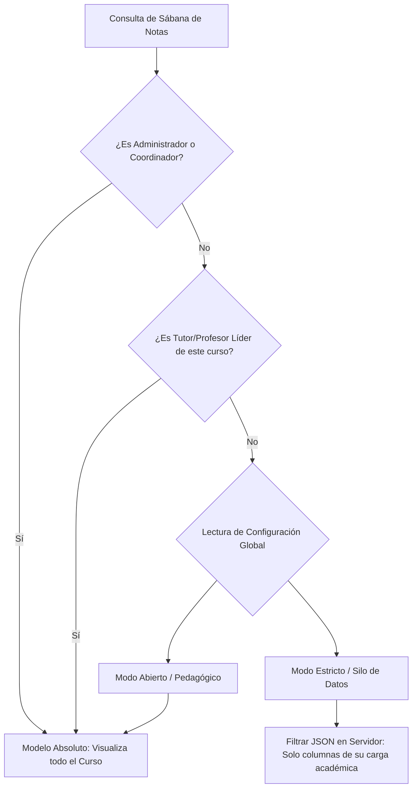

# 🏛️ Arquitectura del Módulo de Configuración Global: Control de Privacidad y Parámetros del Sistema

Este documento consolida la arquitectura técnica, el diseño relacional de datos y las especificaciones de interfaz de usuario para el nuevo **Módulo de Configuración Global** de la plataforma, rigiéndose estrictamente por el estándar estético y funcional **Vitrina 06 (Elite)** y la doctrina de interactividad **Ares**.

El diseño del módulo busca el equilibrio definitivo entre la agilidad administrativa de los Coordinadores y Directores, y la privacidad transversal del personal docente (catedráticos).

---

## 1. 🗄️ Arquitectura del Motor de Datos (SQLite Key-Value Engine)

Para garantizar un motor de configuración ligero, altamente concurrente y resistente a fallos, se implementa una estructura de almacenamiento llave-valor híbrida en la base de datos central SQLite (`php/database/usuarios.db`).

Para evitar cuellos de botella en la lectura y escritura masiva de configuraciones, la tabla está diseñada para ser indexada en memoria (caché a nivel de script) y utilizar el modo **WAL (Write-Ahead Logging)** integrado en el núcleo del sistema.

### Esquema de Base de Datos (`configuracion_global`)
```sql
CREATE TABLE IF NOT EXISTS configuracion_global (
    id INTEGER PRIMARY KEY AUTOINCREMENT,
    clave TEXT NOT NULL UNIQUE,
    valor TEXT NOT NULL,
    tipo_dato TEXT NOT NULL CHECK(tipo_dato IN ('boolean', 'integer', 'string', 'float', 'json')),
    categoria TEXT NOT NULL CHECK(categoria IN ('seguridad', 'academico', 'estetica', 'privacidad')),
    nombre_legible TEXT NOT NULL,
    descripcion TEXT,
    editable_por TEXT DEFAULT 'coordinador' CHECK(editable_por IN ('administrador', 'coordinador')),
    updated_at DATETIME DEFAULT CURRENT_TIMESTAMP
);

-- Índice táctico para lecturas en milisegundos
CREATE UNIQUE INDEX IF NOT EXISTS idx_config_global_clave ON configuracion_global (clave);
```

### Semilla de Configuración de Privacidad (Seeder Inicial)
```sql
INSERT OR IGNORE INTO configuracion_global (clave, valor, tipo_dato, categoria, nombre_legible, descripcion, editable_por)
VALUES (
    'privacidad_catedratico_sabana',
    'estricto',
    'string',
    'privacidad',
    'Modo de Privacidad Transversal para Catedráticos',
    'Establece si un docente especialista (catedrático) puede ver la sábana completa de notas (abierto) o únicamente las asignaturas asignadas a su carga académica (estricto).',
    'coordinador'
);
```

---

## 2. 🔐 Matriz de Permisos y Flujo Transversal de Privacidad

La privacidad del sistema debe blindarse a nivel del servidor (Backend Supremacy). Queda terminantemente prohibido delegar el filtrado de privacidad al navegador (JS de cliente), garantizando que el JSON retornado por la API contenga exclusivamente los datos permitidos por la coordinación.

### 🛡️ Los Dos Modelos de Privacidad Transversal



#### A. Modelo Abierto (Contexto Pedagógico)
*   **Comportamiento**: Los catedráticos visualizan la Sábana de Notas completa del curso en el que imparten clases, pudiendo ver el rendimiento de los alumnos en asignaturas de otros docentes.
*   **Justificación Pedagógica**: Facilita el análisis psicológico y holístico del estudiante, permitiendo al docente realizar intervenciones informadas sobre el estado general del alumno.

#### B. Modelo Estricto (Silo de Datos) - *Predeterminado para Evitar Rivalidades*
*   **Comportamiento**: El motor de la API (`php/logica/api_sabana.php`) intercepta la petición, verifica las materias asociadas a la carga académica activa del docente para el curso consultado, y purga dinámicamente el JSON.
*   **Justificación Administrativa**: Previene comparaciones informales y hostilidad profesional entre docentes que dictan asignaturas similares en diferentes secciones.
*   **Flujo Técnico de Filtrado (en `api_sabana.php`)**:
    ```php
    // Obtener estado del interruptor de privacidad global
    $stmt_config = $db->prepare("SELECT valor FROM configuracion_global WHERE clave = 'privacidad_catedratico_sabana' LIMIT 1");
    $stmt_config->execute();
    $modo_privacidad = $stmt_config->fetchColumn() ?: 'estricto';

    if ($modo_privacidad === 'estricto' && !$es_admin && !$es_tutor) {
        // 1. Consultar exclusivamente las materias asociadas al docente en el curso
        $stmt_docente_materias = $db->prepare("
            SELECT DISTINCT especialidad_id 
            FROM carga_academica 
            WHERE curso_id = ? AND docente_id = ?
        ");
        $stmt_docente_materias->execute([$curso_id, $mi_id]);
        $materias_permitidas = $stmt_docente_materias->fetchAll(PDO::FETCH_COLUMN) ?: [];

        // 2. Filtrar el listado de materias retornado
        $materias = array_filter($materias, function($mat) use ($materias_permitidas) {
            return in_array((int)$mat['id'], $materias_permitidas);
        });
        $materias = array_values($materias); // Resetear índices

        // 3. Filtrar las calificaciones en la matriz de estudiantes
        foreach ($matriz_estudiantes as &$estudiante) {
            $estudiante['calificaciones'] = array_filter($estudiante['calificaciones'], function($materia_id) use ($materias_permitidas) {
                return in_array((int)$materia_id, $materias_permitidas);
            }, ARRAY_FILTER_USE_KEY);
        }
    }
    ```

---

## 3. 🎨 Diseño de Interfaz de Usuario (Estándar Vitrina 06 & Ares)

El Panel de Configuración Global debe irradiar la elegancia y simetría de una vitrina de exhibición de alta gama. Su diseño visual sigue a rajatabla la métrica interactiva obligatoria del sistema.

### 📐 Parámetros de Geometría y Estilo Soberanos
*   **Interactividad**: Altura física exacta de **44px** para todos los controles interactivos, switches e inputs.
*   **Radio de Prestigio**:
    *   Bordes de los componentes, tarjetas de configuración y selectores: **12px**.
    *   Paneles maestros de control e interactividad: **24px**.
*   **Cero HEX**: Prohibido usar código de color hexadecimal. Todo color se define mediante `var(--el-*)` para respetar el tema y la paleta institucional activa del sistema.
*   **Física de Sombras**: Las sombras se proyectan utilizando el matiz primario del sistema para dar una sensación de iluminación orgánica y premium:
    `box-shadow: 0 8px 30px rgba(var(--el-primary-rgb), 0.12);`
*   **Movimiento de Seda**: Transiciones y efectos hover suaves y uniformes:
    `transition: all 0.4s cubic-bezier(0.4, 0, 0.2, 1);`

### 🎛️ Componente de Control: Switch iOS Premium (Clase BEM-Elite)
El control principal para activar/desactivar opciones utiliza una arquitectura limpia BEM.

#### Código CSS de Diseño (`styles/componentes/elite-switch.css`)
```css
@layer components {
    .elite-switch {
        display: inline-flex;
        align-items: center;
        gap: 1rem;
        cursor: pointer;
        user-select: none;
        height: 44px; /* Métrica obligatoria 44px */
        padding-inline: 1rem;
        border-radius: 12px; /* Radio de prestigio para controles */
        background: rgba(var(--el-bg-rgb), 0.04);
        transition: background 0.4s cubic-bezier(0.4, 0, 0.2, 1);
    }

    .elite-switch:hover {
        background: rgba(var(--el-bg-rgb), 0.08);
    }

    .elite-switch__input {
        display: none;
    }

    .elite-switch__track {
        position: relative;
        width: 52px;
        height: 28px;
        background: rgba(var(--el-bg-rgb), 0.16);
        border-radius: 999px;
        transition: background 0.4s cubic-bezier(0.4, 0, 0.2, 1);
    }

    .elite-switch__thumb {
        position: absolute;
        top: 2px;
        inset-inline-start: 2px;
        width: 24px;
        height: 24px;
        border-radius: 50%;
        background: #ffffff;
        box-shadow: 0 2px 8px rgba(0, 0, 0, 0.15); /* Sombra física suave */
        transition: transform 0.4s cubic-bezier(0.4, 0, 0.2, 1);
    }

    /* Estados Activos */
    .elite-switch__input:checked + .elite-switch__track {
        background: var(--el-primary); /* Color Primario del Sistema */
    }

    .elite-switch__input:checked + .elite-switch__track .elite-switch__thumb {
        transform: translateX(24px); /* Movimiento físico de seda */
    }
}
```

#### Código HTML Semántico (Vitrina 06)
```html
<label class="elite-switch">
    <input type="checkbox" id="switch-privacidad" class="elite-switch__input" checked>
    <div class="elite-switch__track">
        <div class="elite-switch__thumb"></div>
    </div>
    <span class="elite-switch__label" style="font-family: var(--el-font-institutional);">
        Activar Modo Silo de Datos (Restricción de Sábanas a Catedráticos)
    </span>
</label>
```

---

## 4. ⚡ Integración Asíncrona (Ares Hefesto Engine)

Para evitar recargas abruptas de pantalla que degraden la experiencia premium del usuario, todos los cambios se guardan mediante peticiones asíncronas con persistencia optimizada.

*   **Veto Absoluto**: Prohibido usar `window.location.reload()`.
*   **Transparencia de Feedback**: El switch o input cambia de estado inmediatamente en la interfaz y dispara un efecto pulsante suave. Si la petición de red falla, se revierte suavemente con una transición animada de seda y notifica el error sin alertar código técnico del servidor.
*   **Protección Blindada (OWASP)**: Cada guardado via `POST` requiere de forma obligatoria un token CSRF de integridad de sesión.

---

## 5. 🔬 Plan de Verificación y Auditoría

Para consolidar la entrega bajo la doctrina de ingeniería de élite, se establecen las siguientes pruebas de verificación:

### Pruebas de Base de Datos
*   Verificar que la creación de la tabla y los índices en `db_integridad.php` se ejecuten sin interferir con los datos existentes de estudiantes o docentes.
*   Confirmar que las consultas de llave-valor se beneficien del indexador en menos de 5ms.

### Pruebas de Privacidad Transversal
1.  **Caso Admin / Coordinador**: Iniciar sesión como Coordinador y validar que la sábana de notas del grado `11-A` liste todas las asignaturas (Física, Matemáticas, Química).
2.  **Caso Docente Tutor**: Iniciar sesión como un Docente que es tutor del grado `11-A` y validar el acceso a todas las materias de su grupo.
3.  **Caso Docente Catedrático (Modo Abierto)**: Validar que el docente catedrático que solo dicta *Física* visualice también las columnas de *Matemáticas* y *Química* si la configuración global está en `abierto`.
4.  **Caso Docente Catedrático (Modo Estricto - Silo)**: Con la opción configurada en `estricto`, verificar que el JSON retornado de la API y la vista de la sábana de notas oculte de forma hermética las columnas y datos de *Matemáticas* y *Química*, mostrando única y exclusivamente *Física*.

---

*Documento de Ingeniería y Arquitectura creado para revisión estructural.*
*Aprobado para desarrollo por: Ingeniero Ricardo*
