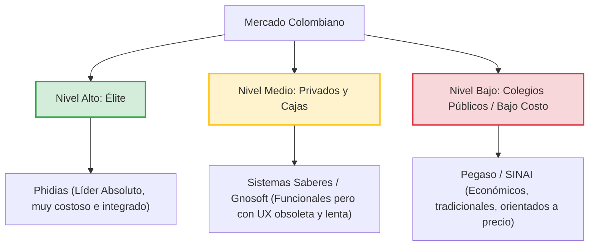

# Análisis de Posicionamiento y Viabilidad Comercial: Mercado Colombiano

Este documento detalla el estado actual, ventajas competitivas, competidores clave y requisitos críticos para el despliegue comercial exitoso de la plataforma de gestión escolar en **Colombia**.

---

## 📊 1. Posicionamiento del Sistema (Estado Actual)

| Factor de Evaluación | Estado en la Plataforma | Impacto en el Mercado Colombiano |
| :--- | :--- | :--- |
| **Experiencia de Usuario (UX)** | 💎 Alta fidelidad (Vitrina 06+), transiciones de seda y SPA fluida sin recargas. | **Muy Superior**. El 90% del software escolar en Colombia utiliza plantillas obsoletas y lentas de la década pasada. |
| **Facilidad Operativa** | ⚡ Interacciones rápidas mediante *Drag & Drop* para Carga Académica y Horarios. | **Alta Tracción**. Simplifica sustancialmente el trabajo administrativo, reduciendo el tiempo de configuración de semanas a horas. |
| **Estructura Académica** | 🎓 Niveles del 1 al 11 (adaptable a Primaria, Secundaria y Media). | **Compatibilidad Directa**. Alineación natural con el esquema formal del Ministerio de Educación Nacional (MEN). |

---

## 🏆 2. Análisis de Competidores en Colombia

El mercado de software de gestión escolar en Colombia se divide en tres niveles operativos:

### 🎯 Nuestra Oportunidad Comercial:
*   **Frente al Nivel Alto (Phidias)**: Capturar a los colegios de estratos 3 y 4 que desean una plataforma premium de alta velocidad pero no pueden costear los altos cánones de licenciamiento de Phidias.
*   **Frente al Nivel Medio (Gnosoft / Saberes)**: Ofrecer a los docentes una herramienta donde subir notas y gestionar horarios no sea un dolor de cabeza. La simplicidad de nuestro diseño (UX) es nuestro mayor gancho de venta.

---

## 📋 3. Requisitos Críticos de Adaptación Local (Brechas Obligatorias)

Para competir de manera legal y efectiva en el territorio colombiano, es indispensable incorporar las siguientes características:

### ⚖️ A. Escala de Valoración Nacional (Decreto 1290 de 2009)
La legislación colombiana prohíbe el uso exclusivo de notas numéricas en los reportes finales, exigiendo una traducción a la escala nacional de desempeños:
1.  **Desempeño Superior**
2.  **Desempeño Alto**
3.  **Desempeño Básico**
4.  **Desempeño Bajo**

> [!IMPORTANT]
> El sistema debe traducir automáticamente los promedios numéricos de las actividades (módulo *Ares*) a estos rangos conceptuales y permitir la creación de **descriptores cualitativos ("Logros")** por asignatura y periodo.

### 📥 B. Integración con el SIMAT (Sistema de Matrícula Estudiantil)
Las secretarías de educación exigen que toda la matrícula oficial se reporte a través del portal nacional **SIMAT**.
*   **Requerimiento**: Desarrollar un importador/exportador de plantillas de Excel (.xlsx / .csv) alineadas con las columnas del SIMAT para evitar que el personal administrativo del colegio deba matricular dos veces a los estudiantes (una en el SIMAT y otra en nuestra plataforma).

### 📄 C. Boletín Oficial de Calificaciones PDF
El reporte de calificaciones final es un documento legal de alta relevancia para traslados y certificaciones.
*   **Requerimiento**: Diseñar una plantilla de generación de reportes en PDF exportable por curso que incluya:
    *   Tabla resumida de fallas (inasistencias).
    *   Desglose de logros del Decreto 1290 por materia.
    *   Cuadro de honor o puesto ocupado en el grupo.
    *   Observaciones del Director de Grupo (tutor).
    *   Firmas digitales y sellos del Rector y Director de Grupo.
