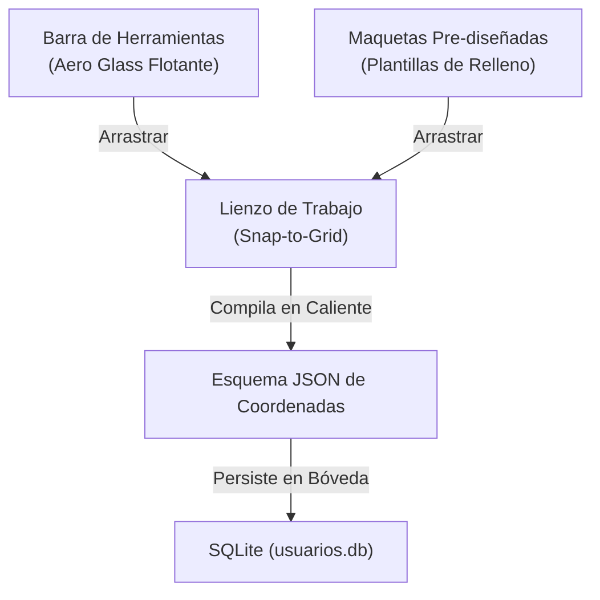

# 🎨 ARES VISUAL CANVAS (EL LIENZO ACADÉMICO)
### 🏛️ Propuesta Arquitectónica y Visión de Ingeniería  
**CONCEPTO ORIGINAL:** Ingeniero Ricardo  
**ESTADO:** Fase de Concepción Estratégica (Roadmap Élite)  
**ESTÁNDAR VISUAL:** Vitrina 06 / Aero Glass  

---

> [!NOTE]
> *"Yo sueño con un editor de preguntas como un Illustrator... una barra de herramientas y un lienzo donde poner y construir todo lo que se nos venga en gana y además tendríamos preguntas ya prediseñadas, maquetas para rellenarlas..."*  
> — **Ingeniero Ricardo**

---

## 🏛️ 1. La Filosofía del Diseño: Libertad Absoluta
El **Ares Visual Canvas** rompe definitivamente con la "tiranía de los formularios lineales". En lugar de obligar al docente a llenar campos verticales aburridos, esta herramienta le otorga un **espacio de trabajo bidimensional libre**, donde la disposición espacial de la información es parte fundamental de la pedagogía.



---

## 🎨 2. Anatomía de la Interfaz (Vitrina 06)

La interfaz se diseña bajo el concepto de **Estación de Trabajo Creativa**, adoptando una estética premium y fluida:

### A. La Barra de Herramientas (Paleta Flotante)
Ubicada en el lateral izquierdo, flotando sobre el lienzo con un fondo de vidrio esmerilado (*Aero Glass*, `backdrop-filter: blur(12px)`), bordes curvados de `12px` y sombras con matiz primario:
*   `[T]` **Bloque de Texto Dinámico:** Cajas de texto enriquecido para enunciados o fragmentos de lectura.
*   `[📷]` **Contenedor Multimedia:** Zonas de arrastre para imágenes, diagramas de flujo o circuitos.
*   `[🔘]` **Ranura de Opción (Choice Slot):** Pines circulares interactivos de 44px de diámetro que el docente puede colocar físicamente encima de cualquier coordenada (ej: sobre una parte de una imagen anatómica o línea de código).
*   `[🔗]` **Conector Vectorial:** Herramienta para trazar líneas de asociación (SVG) entre objetos.
*   `[📍]` **Zona Caliente (Hotspot):** Un lazo interactivo para delimitar áreas de respuesta correcta en imágenes técnicas.

### B. El Lienzo (Canvas Grid)
*   **Alineación Magnética (Snap-to-Grid):** Una cuadrícula sutil de `10px` que atrae a los elementos cercanos, forzando a que la alineación de las preguntas sea quirúrgica e impecable de manera automática.
*   **Escalado de Seda:** Cada objeto colocado en el lienzo cuenta con tiradores interactivos en las esquinas que permiten redimensionarlos con transiciones fluidas de `cubic-bezier(0.4, 0, 0.2, 1)`.
*   **Capas (Z-Index Virtual):** El profesor puede ordenar qué elemento va al frente o al fondo (ej: colocar texto explicativo flotando sobre una sección de una imagen).

### C. El Banco de Maquetas (Templates de Relleno)
Ubicado en la parte superior, ofrece bloques pre-construidos que el docente solo tiene que arrastrar al lienzo y completar mediante doble clic:
*   *Maqueta de Apareamiento:* Dos columnas de 4 bloques listas para conectar con líneas.
*   *Maqueta de Selección Múltiple Clásica:* Un bloque de enunciado con 4 botones de opción perfectamente alineados.
*   *Maqueta de Completar Contexto (Cloze):* Un párrafo pre-formateado con ranuras para menús desplegables.

---

## ⚙️ 3. El Motor de Serialización JSON
Detrás del lienzo, toda la disposición visual se traduce de forma matemática en un esquema JSON estructurado y ligero. Esto evita almacenar pesados archivos HTML o tablas relacionales complejas:

```json
{
  "canvas": {
    "width": 1200,
    "height": 800,
    "background_color": "var(--el-bg-neutral-light)"
  },
  "nodes": [
    {
      "id": "node_img_01",
      "tipo": "imagen",
      "src": "uploads/mapa_mundi.jpg",
      "x": 150,
      "y": 100,
      "w": 900,
      "h": 500,
      "bloqueado": true
    },
    {
      "id": "choice_opt_01",
      "tipo": "choice_slot",
      "x": 320,
      "y": 240,
      "w": 44,
      "h": 44,
      "valor_correcto": "América del Sur",
      "grupo_pregunta": "p_geografia_1"
    },
    {
      "id": "choice_opt_02",
      "tipo": "choice_slot",
      "x": 680,
      "y": 180,
      "w": 44,
      "h": 44,
      "valor_correcto": "Europa",
      "grupo_pregunta": "p_geografia_1"
    }
  ]
}
```

---

## 🚀 4. El Reproductor Adaptativo (Ares Canvas Player)
Cuando el estudiante inicia la prueba, el **Ares Canvas Player** interpreta este JSON:
1.  **Escalado Responsivo:** Adapta las coordenadas X/Y del lienzo al tamaño de pantalla del dispositivo del alumno (tablet, laptop o móvil) manteniendo la relación de aspecto exacta y la precisión de clic (mínimo 44px interactivos).
2.  **Líneas SVG Activas:** En preguntas de apareamiento, el estudiante arrastra el dedo o mouse desde un concepto a otro y una línea de color primario HSL se dibuja vectorialmente en tiempo real.
3.  **Auditoría de Clics (Sentinel Engine):** Registra si el estudiante intentó interactuar fuera de las zonas permitidas para evitar fatiga cognitiva o comportamientos sospechosos.

---

## 📍 5. Hoja de Ruta de Desarrollo Recomendada

Para mantener el control absoluto del código y evitar la sobre-complejidad, se propone un plan de construcción modular:

### 🏁 Fase 1: El Sandbox Base (Maquetación)
*   Diseño de la UI flotante *Aero Glass* del editor.
*   Implementación de la librería nativa de arrastrar y soltar con alineación magnética.
*   Creación de las primeras dos herramientas: Bloque de Texto e Imagen.

### 🔌 Fase 2: El Motor de Compilación
*   Desarrollar el script JS que exporta la posición de los elementos en el lienzo a un JSON estructurado.
*   Construir el backend en PHP para guardar este JSON en la columna `respuestas_json` de la tabla `eval_pruebas`.

### 🎓 Fase 3: El Player Académico
*   Desarrollar el reproductor que lee el JSON de coordenadas y le muestra al alumno el lienzo interactivo tal como lo diseñó su docente.
*   Integrar la lógica de puntuación y auditoría de clic.

---

**CERTIFICACIÓN DE VISIÓN:** Este documento representa de manera fiel e inspiradora la visión de ingeniería formulada por el **Ingeniero Ricardo** para revolucionar el ecosistema de evaluación Ares.
