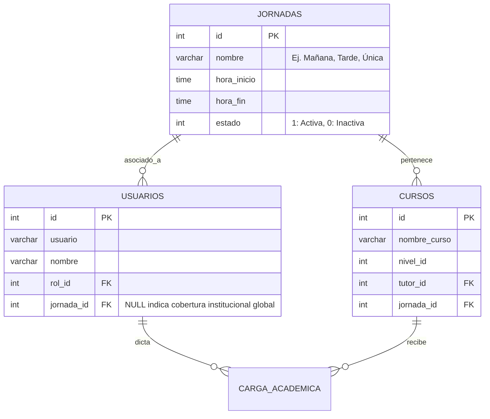

# Especificación de Diseño: Gestión Multijornada y Roles Especializados

Este documento detalla la arquitectura propuesta para la futura ampliación del sistema, permitiendo la asignación y restricción de coordinadores, docentes y estudiantes por jornadas específicas (Mañana, Tarde, Única, Nocturna).

---

## 🏛️ 1. Estructura de Base de Datos Propuesta

Para soportar de manera nativa múltiples jornadas sin duplicar lógica, se propone el siguiente esquema relacional:



---

## 🔒 2. Lógica de Permisos e Inferencia (Reglas de Negocio)

### A. Visibilidad del Coordinador por Jornada
Cuando un usuario tiene `rol_id = 2` (Coordinador) y su `jornada_id` es no nulo (ej. `jornada_id = 1` - Jornada Mañana):
1.  **Filtro en Cursos**: Las consolas de *Cursos* y *Carga Académica* (`Protocolo Atlas`) solo listarán aquellos cursos donde `cursos.jornada_id = 1`.
2.  **Seguridad a Nivel de Controlador (API)**: Cualquier acción de edición (`guardar_curso`, `asignar_carga`, `eliminar_carga`) validará en el backend que el curso afectado pertenezca a la misma jornada del coordinador autenticado:
    ```php
    if ($_SESSION['jornada_id'] !== null && $curso['jornada_id'] !== $_SESSION['jornada_id']) {
        header('HTTP/1.1 403 Forbidden');
        die(json_encode(['success' => false, 'message' => 'Acceso denegado a esta jornada']));
    }
    ```

### B. Control de Carga de Docentes
*   Un docente puede dictar clases en múltiples jornadas. Por lo tanto, en la tabla de `usuarios` la jornada del docente sirve como jornada de contratación principal, pero la tabla de vinculación `carga_academica` permite asociarlo a cursos de cualquier jornada.
*   El cálculo de horas del docente se mantendrá global en el Power Header de Atlas, pero segmentado por jornada en los reportes administrativos.
