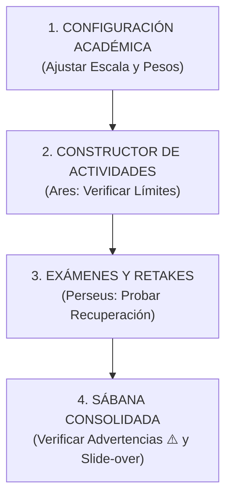

# 🗺️ Guía de Pruebas: Regulación Académica y Motor de Notas (Vitrina 06)

Estimado **Ingeniero Ricardo**, es completamente comprensible sentir que se pierde el hilo ante tantas optimizaciones de ingeniería concurrentes. Para recuperar el control absoluto y verificar que cada engranaje del sistema funciona a la perfección, he diseñado esta guía paso a paso. 

Siga este mapa de ruta interactivo directamente en su servidor local para ver el sistema en acción.

---

---

## 📍 Fase 1: La Torre de Control (Configuración Global)
*El corazón del sistema. Aquí determinamos las reglas del juego para todo el colegio.*

1. **Ruta de Acceso**: Abra su navegador e ingrese a la vista de configuración:
   👉 [http://localhost/sistema_escolar/php/vistas/configuracion.php](http://localhost/sistema_escolar/php/vistas/configuracion.php)
2. **Acción 1: Ajustar la Escala Académica**:
   - Vaya a la pestaña **Académico**.
   - Cambie la escala de notas. Por ejemplo, configure:
     *   **Nota Mínima**: `1.0`
     *   **Nota Máxima**: `5.0`
     *   **Nota Aprobación**: `3.0` (El sistema auto-completará el "Mínimo Básico" a `3.0`).
3. **Acción 2: Modificar los Pesos y Planes Mínimos**:
   - Observe la tabla **Ponderaciones y Plan de Notas Mínimas**. ¡Mire qué limpios y alineados lucen ahora los inputs de **PESO (%)** sin el molesto `%` amarillo que se desbordaba!
   - Cambie los pesos de las dimensiones asegurándose de que sumen **100%** (ej: Saber `40%`, Hacer `30%`, Ser `30%`).
   - Configure las **Notas Mínimas** requeridas (ej: `2` notas obligatorias por dimensión para que el sistema dé el visto bueno al profesor).
4. **Acción 3: Definir la Política de Retakes (Recuperación)**:
   - En el selector de **Política Institucional de Recuperaciones (Retakes)**, elija una de las 3 opciones de cálculo matemático:
     *   `REEMPLAZO DIRECTO` (Sustituye la nota original si la recuperación es mayor).
     *   `PROMEDIO SIMPLE` (Sustituye el definitivo por la media entre ambas).
     *   `LÍMITE DE APROBACIÓN` (Reemplaza pero topa la nota resultante en la nota aprobatoria, ej. `3.0`).
5. **Guardar**: Presione **GUARDAR REGULACIÓN ACADÉMICA**. El sistema procesará el cambio mediante AJAX fluido y presentará un banner premium de éxito.

---

## 📍 Fase 2: El Motor Ares (Creación de Actividades y Focus Mode)
*Aquí actúa el docente en su día a día.*

1. **Ruta de Acceso**: Ingrese al constructor de actividades del profesor:
   👉 [http://localhost/sistema_escolar/php/vistas/constructor_actividades.php](http://localhost/sistema_escolar/php/vistas/constructor_actividades.php)
2. **Acción 1: Comprobar Límites Dinámicos**:
   - Intente crear una actividad y calificar a un estudiante.
   - Observe los sliders y los campos numéricos del **Focus Mode**. 
   - *Verificación*: Verifique que el rango máximo de calificación se adapte automáticamente a la **Nota Máxima** (ej. `5.0`) que configuró en la Fase 1. Intente ingresar un `6.0` y observe cómo el navegador le impide hacerlo respetando las reglas de validación de `window.AresEscala`.
3. **Acción 2: Inyectar una Nota de Recuperación (Retake)**:
   - En el Focus Mode, capture una nota baja para un estudiante (ej. `2.0`, reprobatoria).
   - Inyecte una **Nota de Recuperación** (ej. `4.5`) en el campo correspondiente.
   - Guarde la calificación. El backend almacenará la nota original y el retake de forma totalmente independiente para no corromper el historial.

---

## 📍 Fase 3: El Calificador Digital de Pruebas (Perseus Engine)
*La inyección digital de evaluaciones en línea.*

1. **Ruta de Acceso**: Diríjase al calificador digital de exámenes:
   👉 [http://localhost/sistema_escolar/php/vistas/calificar_pruebas.php](http://localhost/sistema_escolar/php/vistas/calificar_pruebas.php)
2. **Acción**: Califique o edite la entrega de un examen en línea.
   - Podrá introducir tanto la calificación digital regular como la **calificación de recuperación**.
   - Digite una nota de recuperación y observe cómo el panel recalcula la **Nota Definitiva** en tiempo real en la pantalla del profesor según la política seleccionada (ej. si seleccionó *Promedio Simple*, verá cómo promedia en el acto `2.0` y `4.5` dando un `3.25`).

---

## 📍 Fase 4: La Sábana Consolidada (La Prueba de Fuego)
*Donde los directivos y coordinadores ven la verdad.*

1. **Ruta de Acceso**: Ingrese al visor oficial de sábanas y consolidados:
   👉 [http://localhost/sistema_escolar/php/vistas/sabana_calificaciones.php](http://localhost/sistema_escolar/php/vistas/sabana_calificaciones.php)
2. **Acción 1: Auditar el Semáforo de Cobertura y Precisión**:
   - Seleccione un curso y un docente.
   - Observe el semáforo premium. Ahora le mostrará no solo si el docente evaluó los DBAs generales (Cobertura Macro), sino la **Precisión Curricular** exacta (cuántas evidencias unitarias del MEN ha calificado).
3. **Acción 2: El Triángulo de Advertencia de Plan de Evaluaciones (⚠️)**:
   - Recuerde que en la Fase 1 configuramos que cada dimensión requería mínimo `2` notas.
   - Si el docente de la asignatura actual solo ha registrado 1 actividad en la dimensión *Hacer*, aparecerá un triángulo amarillo de advertencia `⚠️` al lado del nombre de su asignatura.
   - Pase el cursor por encima del triángulo `⚠️` para ver el tooltip flotante con el desglose granular (ej: *"Plan incompleto: Requiere mín. 2 actividades en Hacer (Registradas: 1)"*). ¡Esto asegura el control de calidad docente!
4. **Acción 3: Inspeccionar el Slide-over de Calificaciones**:
   - Haga clic sobre una calificación final en la sábana para desplegar el panel lateral premium (**Slide-over**).
   - *Verificación*: Encontrará un desglose quirúrgico que detalla:
     *   Nota de la Actividad 1 (Original y Recuperación si la hubo).
     *   La fórmula aritmética aplicada paso a paso según la política activa del colegio.
     *   El promedio ponderado definitivo libre de discrepancias.

---

## 📍 Fase 5: Consola de Calidad y Pruebas Formales (Test Runner)
*El auditor de código e integridad evaluativa en caliente.*

1. **Ruta de Acceso**: Ingrese al panel maestro de pruebas unitarias en vivo:
   👉 [http://localhost/sistema_escolar/php/dashboard.php?p=pruebas_formales](http://localhost/sistema_escolar/php/dashboard.php?p=pruebas_formales)
2. **Acción 1: Auditoría de Configuración Global**:
   - Observe la tarjeta superior. El sistema lee y presenta la escala de notas institucional (Mínima, Máxima, Aprobación) y la política de recuperación global configurada directamente desde la base de datos local SQLite.
3. **Acción 2: Verificación de Aserciones Automáticas**:
   - Revise la tabla del desglose de casos de prueba. El test ejecuta 9 aserciones en vivo sobre la lógica aritmética:
     - **Reemplazo Directo** (Casos 1 al 3): Comprobar que si la nota de recuperación es mayor a la original, la reemplaza de inmediato. Si es menor, la ignora para proteger al estudiante.
     - **Promedio Simple** (Casos 4 al 6): Comprobar el cálculo de la media exacta y su correcto redondeo decimal a un decimal (ej. `3.3`).
     - **Límite de Aprobación** (Casos 7 al 9): Comprobar que cualquier nota de recuperación superior al límite mínimo aprobatorio se tope estrictamente en el valor de aprobación configurado.
   - Verifique que la columna **Resultado** muestre badges de éxito en color verde esmeralda (`PASÓ`).
4. **Acción 3: Ejecución Dinámica**:
   - Presione el botón **Volver a Ejecutar** de 44px de alto para re-correr los cálculos del motor y verificar la consistencia del rendimiento de carga.
