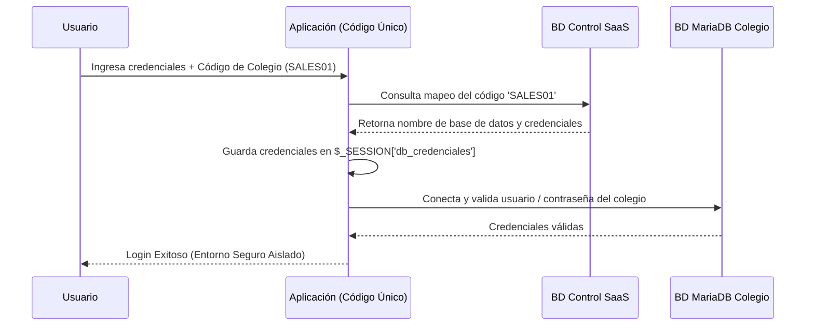

# 🏛️ PLAN DE MIGRACIÓN: MARIADB Y ARQUITECTURA MULTI-INQUILINO ELITE

Este documento establece la estrategia, ventajas y diseño de arquitectura para la migración del sistema escolar a **MariaDB** bajo un modelo SaaS multi-inquilino (una única aplicación, múltiples bases de datos dedicadas por colegio) hospedado en **BanaHosting**.

---

## 1. Justificación de la Elección de MariaDB

La decisión de migrar el entorno de producción a **MariaDB** responde a necesidades críticas de concurrencia y escalabilidad que SQLite no puede resolver en un entorno multiusuario real.

### 📊 Análisis Comparativo: SQLite vs MariaDB (Multi-inquilino)

| Característica | SQLite (Archivo Local) | MariaDB (BanaHosting) |
| :--- | :--- | :--- |
| **Bloqueos de Concurrencia** | A nivel de archivo completo (bloquea escrituras concurrentes). | A nivel de fila (múltiples escrituras simultáneas). |
| **Consumo de Memoria RAM** | Nulo en reposo, moderado en lectura de archivos grandes. | Optimizado mediante Pool de Hilos (Thread Pooling). |
| **Estructuras Complejas (JSON)** | Limitado. Requiere parseo externo en PHP para búsquedas. | Soporte nativo para indexación y consulta JSON. |
| **Seguridad de Datos** | Vulnerable si un archivo se corrompe en disco. | Aislamiento completo por motor de almacenamiento (InnoDB). |

---

## 2. Ventajas y Desventajas de la Migración

### 👍 Ventajas Técnicas (Pros)
* **Alta Concurrencia sin Bloqueos**: Crucial para el módulo de evaluaciones cuando 30 a 40 estudiantes envían respuestas al mismo segundo.
* **Compatibilidad Directa**: Funciona como reemplazo directo (*Drop-in*) de MySQL sin necesidad de reescribir consultas en la aplicación.
* **Aislamiento Multicolegio**: Cumplimiento estricto de seguridad de datos al tener bases de datos dedicadas por institución.
* **Rendimiento NVMe**: Optimizado para la alta velocidad de lectura/escritura provista en el almacenamiento SSD NVMe de BanaHosting.

### 👎 Limitaciones y Desafíos (Contras)
* **Migración de Esquema**: Se requiere actualizar de forma coordinada el esquema físico en todas las bases de datos de los colegios ante cambios en el sistema.
* **Dependencia de Red**: A diferencia de SQLite, el entorno local de desarrollo requiere configurar un servidor local de MariaDB/MySQL o usar un interruptor híbrido.

---

## 3. Diseño de la Arquitectura SaaS Dinámica

Para mantener una sola instalación de la aplicación web sirviendo a múltiples colegios con bases de datos MariaDB totalmente aisladas, implementamos el siguiente flujo de conexión:



---

## 4. Estructura Híbrida de Conexión (Desarrollo vs Producción)

Para no entorpecer el desarrollo local y mantener el flujo ágil en su computadora, modificamos el conector [db.php](file:///c:/xampp/htdocs/sistema_escolar/php/db.php) para trabajar de forma híbrida:

```php
// Ejemplo del diseño híbrido del conector db.php
if (strpos($_SERVER['HTTP_HOST'], 'localhost') !== false || strpos($_SERVER['HTTP_HOST'], '127.0.0.1') !== false) {
    // ENTORNO LOCAL: Conexión ligera SQLite
    $db = new PDO("sqlite:" . __DIR__ . "/database/sistema.sqlite");
} else {
    // ENTORNO PRODUCCIÓN: Conexión MariaDB Dinámica por Sesión
    if (isset($_SESSION['colegio_db_name'])) {
        $db_name = $_SESSION['colegio_db_name'];
        $db_user = $_SESSION['colegio_db_user'];
        $db_pass = $_SESSION['colegio_db_pass'];
        $db = new PDO("mysql:host=localhost;dbname=$db_name;charset=utf8mb4", $db_user, $db_pass);
    } else {
        // Conexión por defecto a la base de control para inicio de sesión
        $db = new PDO("mysql:host=localhost;dbname=control_saas;charset=utf8mb4", "usuario_control", "password");
    }
}
```

---

## 5. Organización Física de Archivos Subidos (`uploads`)

Para mantener los assets de Canvas y tareas totalmente ordenados por colegio bajo una única aplicación, los directorios se estructurarán dinámicamente usando el ID del colegio registrado en la sesión:

```
sistema_escolar/
├── uploads/
│   ├── colegios/
│   │   ├── colegio_1/
│   │   │   ├── reactivos/        <-- Imágenes Canvas WebP del Colegio 1
│   │   │   └── aula/             <-- Recursos de clase del Colegio 1
│   │   └── colegio_2/
│   │       ├── reactivos/        <-- Imágenes Canvas WebP del Colegio 2
│   │       └── aula/             <-- Recursos de clase del Colegio 2
```

Esta separación física por carpetas permite la realización de **copias de seguridad parciales y descargas independientes** para cada colegio sin afectar la plataforma global.
