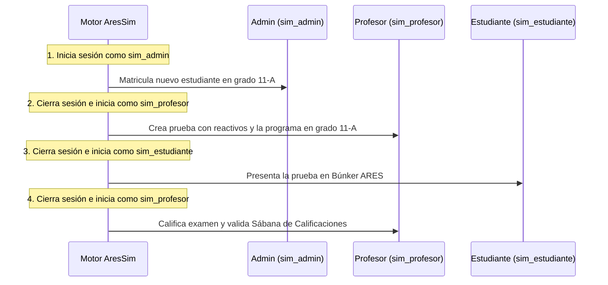

# 🧠 REQUERIMIENTOS DEL SIMULADOR CENTINELA (AresSim)
**Autoridad de Diseño: Ingeniero Ricardo**  
**Versión de Especificación:** 1.0 (Borrador de Arquitectura)

---

## 🏛️ 1. Declaración de Misión
El **Simulador Centinela (AresSim)** es un sistema de pruebas automáticas de extremo a extremo (E2E) y pruebas de caos diseñado de forma nativa para el sistema escolar. Su objetivo es ejecutar simulaciones realistas de comportamiento humano ( Happy Path ) y de estrés extremo ( Chaos Testing ) simulando múltiples roles de usuario reales para detectar rupturas, regresiones y cuellos de botella en todos los módulos de la plataforma sin requerir interacción física del desarrollador.

---

## 👥 2. Modelo de Actores y Credenciales Dedicadas
El simulador operará de manera aislada utilizando cuentas de prueba dedicadas en la base de datos de producción:

| Identidad de Simulación | Rol en el Sistema | Responsabilidades Simulatrónicas |
| :--- | :--- | :--- |
| `sim_admin@colegio.edu.co` | **Administrador** | Matricula alumnos, gestiona cursos, asigna cargas académicas. |
| `sim_profesor@colegio.edu.co` | **Docente** | Crea rúbricas, diseña reactivos, programa exámenes, califica entregas. |
| `sim_estudiante@colegio.edu.co` | **Estudiante** | Navega al búnker ARES, responde ítems, entrega pruebas, ve boletines. |

---

## 🔄 3. El Flujo de Simulación Multi-Usuario (End-to-End Loop)
El motor de simulación debe ser capaz de orquestar flujos de trabajo completos cambiando de usuario de forma automatizada mediante procesos de login asíncronos:

---

## 🎮 4. Modos de Ejecución Operacional

### 🎭 Modo A: Interacción Humana (Happy Path)
*   **Velocidad Humana Real**: Los inputs no se rellenan instantáneamente; el simulador escribe carácter por carácter con retrasos aleatorios de entre 50ms y 150ms.
*   **Movimiento de Cursor**: Un puntero virtual (círculo translúcido color `var(--el-primary)`) se desplaza visiblemente por la pantalla de un elemento a otro usando animaciones `cubic-bezier`.
*   **Focus y Clics**: Hace scroll real hasta el control interactivo (métrica mínima de 44px), simula la onda física del clic y dispara el evento interactivo real.

### 🐒 Modo B: Modo Caos & Estrés (Chaos & Monkey Testing)
*   **Spam de Peticiones**: Doble clics rápidos y masivos en botones de envío ("Guardar") para verificar protección contra concurrencias y duplicaciones de registros.
*   **Entradas Límite y Ataques**: Inyección automática de caracteres inválidos (ej: letras en inputs de notas, números negativos, inyecciones XSS en comentarios) para certificar que el backend/frontend detenga y valide la petición de forma segura.
*   **Formularios Huérfanos**: Intento de envío de formularios vacíos para corroborar el correcto bloqueo de seguridad de SweetAlert2.

---

## 🖥️ 5. Consola de Telemetría e Interfaz Visual (Vitrina 06)
*   **Consola Flotante**: Un panel translúcido fijo en la parte inferior derecha con desenfoque de fondo (`backdrop-filter`) y bordes de 12px.
*   **Logs en Caliente**: Muestra en tiempo real lo que el simulador está ejecutando (ej: `[12:44:05] sim_profesor ingresando rúbrica...`).
*   **Semáforo de Ruptura**: Indicador que se torna rojo brillante en caso de cualquier error HTTP de red, excepción de consola JS o payload JSON de API corrupto (`status !== 'success'`).

---

## 🛡️ 6. Aislamiento y Purga de la Base de Datos (Zero Garbage Policy)
*   **Flag de Identificación**: Todo registro interactivo generado (estudiante matriculado, examen presentado, rúbrica creada) se marca con `es_simulacion = 1`.
*   **Procedimiento de Desmantelamiento (Teardown)**: Al finalizar el ciclo de pruebas (o si se cancela abruptamente), un endpoint administrativo seguro (`logica/api_simulador.php?accion=purgar_datos`) realiza una purga de base de datos en cascada para remover todo rastro de simulación de forma limpia.
